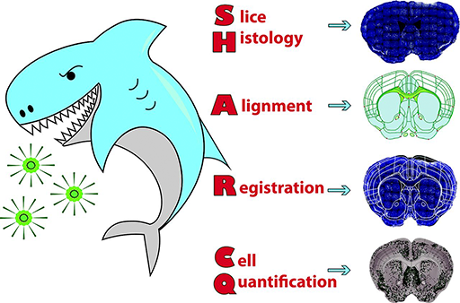
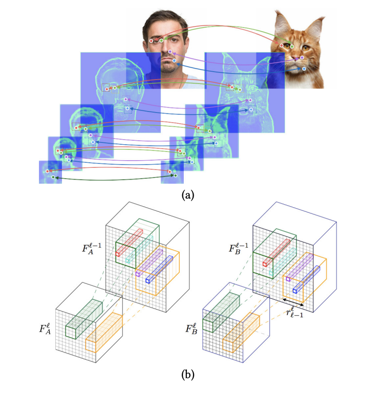
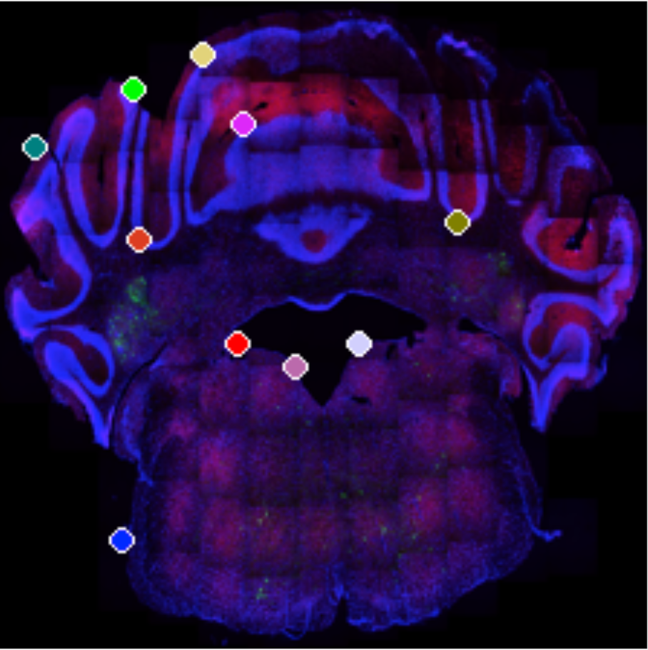
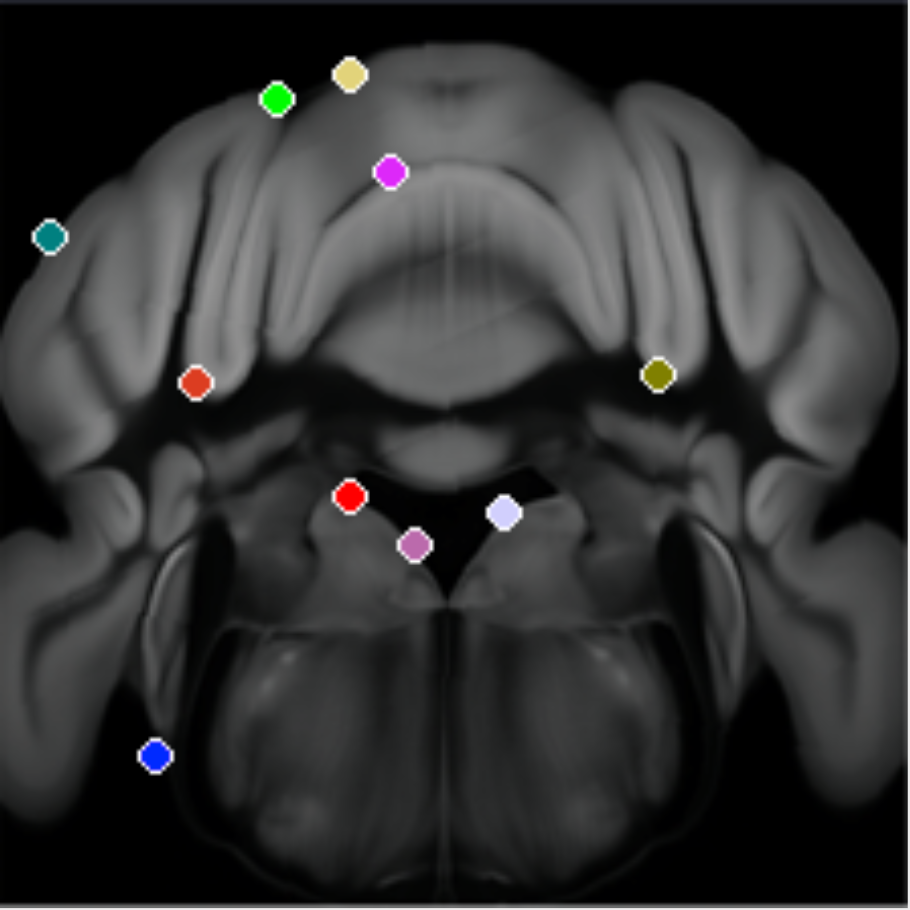
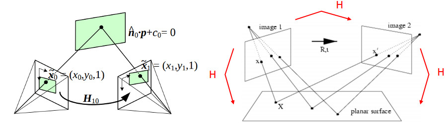
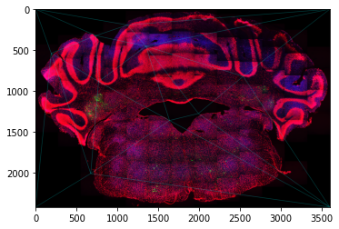
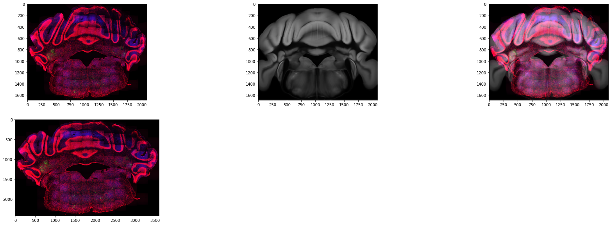

# DeepSEA-SHARCQ

> **D**eep (learning) for **S**implified, **E**nd-to-end **A**utomation
>Developing on
>**S**lice **H**istology **A**lignment **R**egistration and **C**ell **Q**uantification

<div>
    
</div>

## Overview

[SHARCQ Paper](#original-paper)
>Advancements in genetically distinct cell-labeling have begun to outpace the analysis required to quantify
>it. Particularly for whole-brain mapping, robust and automated methods for quick post-imaging analysis
>have become increasingly necessary to process large amounts of data contained in images. To address the
>need for processing high-throughput imaging data, we developed a tool to count fluorescent cells by brain
>region using the digitized Allen Brain Atlas and the modified Franklin–Paxinos Atlas. This tool is called
>SHARCQ (Slice Histology Alignment, Registration, and Cell Quantification).

<!-- SHARCQ is a tool that allows researchers to identify locations and boundries of regions in mouse brains that correlate with standards. How it does this is by standardizing the mouse brain slices into an Atlas Space where the locations and boundries have been outlined.   -->

SHARCQ is developed by my friend and colleage Kristoffer Lauridsen. As stated, the field of Neroscience is moving at an extremly fast rate and methods for analytics are not there to help quantify mass amounts data. The SHARCQ tool was built to help walk through the process of aligning images and counting cells by hand. As data grows this is found to be infeaseble unless supported by a large team. That is where the project DeepSEA-SHARCQ came about. The goal is to automate as much of the processes that were being done by hand using machine learning and efficient data designs.      


# Technology Used

## Deep Slice
[Deep Slice Github](https://github.com/PolarBean/DeepSlice)


## Neural Best Buddies (NBB)

<div>
    
</div>

One of the major challenges faced were aligning brain images with a standard model (Atlas Space). Method developed in SHARCQ were to have a reseracher go image by image and select landmark points on the image that will morph the image. We discovered NBB, this is a method which uses current vision models in machine learning (ML) to identify key landmarks between images in a corresponding domain.   

<div style="overflow:auto; ">
    
    
</div>

### Transform Mouse to Atlas

The next challange was transforming/morphing the Mouse Brain to the Atlas space. At first We tried Homography, a method that adjust a  2d plane in 3d space to create a squeezing, rotation, and other various linear transforms. This was decent but not meeting out expectation for a quality Image overlay. Below is an overview of what Homography is trying to accomplish.  

<div>
    
</div>

Working through the math we were certain we needed a non-linear method for Image morphing. We came across a method of using a triangular mesh that would transform over triangles from one mesh to another linearly reconstructing the mesh in a different space. Below is a picture of the triangle mesh being placed over the Mouse Brain. 

<div style="overflow:auto; ">
    
</div>

We already had the Homography figured out so transforming the triangles to the other mesh was easy. You can see the final output of the whole registration in the below image. The bottom left is the original mouse brain, moving up and over is the flow from transform to overlay. 


<div style="overflow:auto; ">
    
</div>

## Cell Count
The next challange we faced was counting cells in the images, We were for some images using florescent markers that would label the cells body. This method was easy to identify as the cell bodies were just a very white blob. We used algorithms like connected compounents and watershed to identify and count the cells accurately with marginal error. 

[useful tutorial on cell counting](https://pyimagesearch.com/2015/11/02/watershed-opencv/)

The limitation of our software was when the markers would mark the membrane


<!--  -->


## Original Paper

```pdf
	../media/papers/ENEURO.0483-21.2022.full.pdf
```