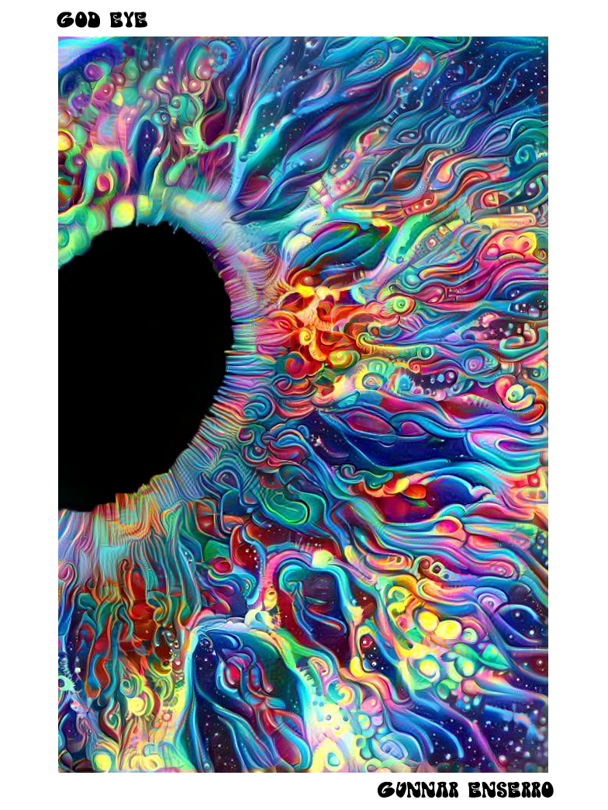

# DeepArt - creative outlet

 ## overview

 This is a special project I started in highschool and just work on when ever I am bored or looking for a creative touch to life. I use various tools like Deep Style, Deep Dream, Photoshop, and Disco Gan to make expressive works of art. It was first started as a generative clothing store call Flux, but then remasted into a Dayzzed. Dayzzed was the name of the more serious version of Flux that was selling more high end pieces. Over the course of serveral yeas I made a fully automated dropshipping store that I could leave alone and my art would be sold at. Bellow are a few of my works!

<!-- slide:break -->

<!-- slide:break -->

<!-- slide:break -->
 

<!-- slide:break -->
 

 <!-- slide:break -->
 